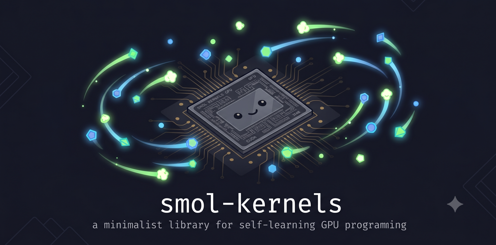

# smol-kernels

GPU programming from scratch with Triton. Benchmarks, kernels, and production patterns — built one unit at a time.

> 🚧 Work in progress — see the [`wip`](https://github.com/abhinand5/smol-kernels/tree/wip) branch for the full curriculum and code.
